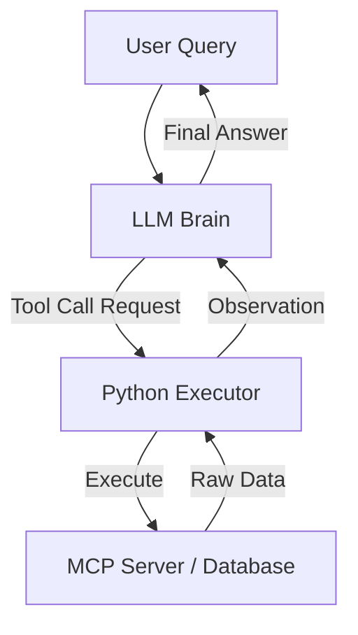
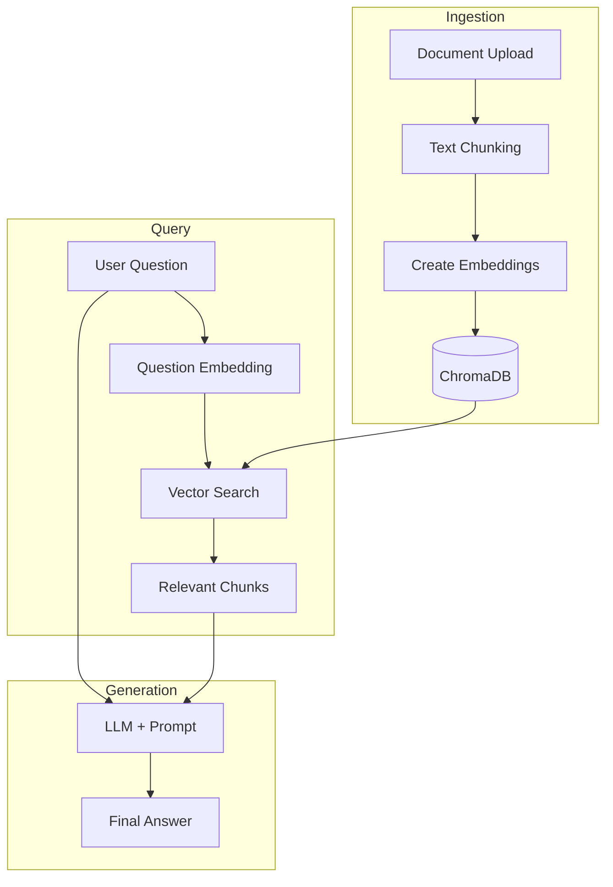

# Module 4: LLM Integration

Welcome to Module 4. In the previous modules, we established the Python foundations, understood MCP architecture, and built basic MCP servers. Now, we bridge the gap between your MCP tools and the intelligence of Large Language Models (LLMs).

This module focuses on making LLMs "use" your MCP tools effectively. We will move from simple text completion to **Tool Calling** (Function Calling), where the LLM decides which tool to execute based on user intent.

## 1. Key Concepts Explained Simply

### Tool Calling (Function Calling)
*   **Simple Terms:** Instead of the LLM just writing a story or an answer, it outputs a structured request saying, "I need to run this specific function with these arguments." Your code then executes that function and sends the result back to the LLM to generate the final answer.
*   **Real-World Analogy:** Imagine a restaurant manager (the LLM). A customer asks, "What's the special today?" The manager doesn't know offhand. They say to the kitchen staff (Your MCP Server), "Check the daily special board." The kitchen staff reads it and tells the manager. The manager then tells the customer. The manager didn't cook; they orchestrated the information retrieval.
*   **Why for MCP?** MCP is essentially a standardized way for LLMs to discover and call tools. Understanding native tool calling in SDKs helps you build the bridge between the LLM and your MCP server.

### Structured Outputs
*   **Simple Terms:** Forcing the LLM to return data in a specific format (like JSON) rather than free text. This is crucial for parsing tool arguments reliably.
*   **Real-World Analogy:** Filling out a government form vs. writing a letter. A form (Structured Output) ensures every field is present and formatted correctly, making it easy for a computer to process. A letter might miss details or use slang.

### Prompt Engineering for MCP
*   **Simple Terms:** Writing instructions that tell the LLM *how* to use the available tools, when to ask for clarification, and how to handle errors.
*   **Real-World Analogy:** Giving a new employee a handbook. You don't just give them keys to the building (tools); you give them a manual on *when* to use which key and what to do if a door is locked.

---

## 2. Architecture Explanation

In an MCP-integrated system using LLMs, the flow looks like this:

1.  **User Input:** "Show me top 5 customers by revenue."
2.  **LLM Router:** The LLM receives the user input + a list of available tools (descriptions and schemas).
3.  **Decision:** The LLM determines it needs the `get_top_customers` tool. It outputs a JSON object: `{"tool": "get_top_customers", "args": {"limit": 5}}`.
4.  **Executor (Python Code):** Your Python script parses this JSON, calls the actual MCP tool (or local function mimicking an MCP tool), and gets raw data.
5.  **Context Injection:** The raw data is sent back to the LLM as "Observation."
6.  **Final Generation:** The LLM synthesizes the raw data into a natural language answer.



---

## 3. Real-World Use Cases

1.  **AI Data Analyst:** Non-technical users query SQL databases using natural language. The LLM converts questions to SQL queries via tools.
2.  **Document Search:** Users ask questions about private PDFs. The LLM uses a `search_documents` tool to retrieve relevant chunks from a vector database before answering.
3.  **DevOps Assistant:** "Restart the production server." The LLM triggers a secure `restart_server` MCP tool after confirming intent.

---

## 4. Libraries Overview

We will use the following modern Python libraries:

*   **OpenAI SDK:** The industry standard for interacting with OpenAI models. Excellent native support for tool calling.
*   **LangChain:** A framework that simplifies chaining LLMs, prompts, and tools. Useful for complex workflows.
*   **LiteLLM:** A unified interface to call OpenAI, Claude, Gemini, etc., with the same code syntax. Great for switching models without rewriting code.
*   **Pydantic:** Essential for defining strict data schemas for tool arguments.

---

## 5. Step-by-Step Implementation Guidance

We will implement **Project 7: AI Data Analyst**. This project demonstrates how an LLM can interpret a user question, select the correct tool, execute it against a mock database, and present the results.

### Project 7: AI Data Analyst

**Objective:** Build a system where a user asks natural language questions about sales data, and the system uses an LLM to call a Python function (simulating an MCP tool) to retrieve and analyze the data.

**Required Tools:**
*   Python 3.9+
*   `openai` library
*   `pydantic`
*   `pandas` (for mock data handling)

**Step-by-Step Coding Instructions:**

1.  **Setup Mock Data:** Create a simple in-memory dataset representing a database.
2.  **Define Tool Schema:** Use Pydantic to define exactly what arguments the tool expects.
3.  **Implement Tool Logic:** Write the Python function that actually filters/sorts the data.
4.  **Configure LLM Client:** Initialize the OpenAI client with the tool definition.
5.  **Execution Loop:**
    *   Send user query to LLM.
    *   Check if LLM wants to call a tool.
    *   If yes, execute the tool, get results, send back to LLM.
    *   If no, print the LLM's final text response.

### Complete Python Code

Ensure you have the dependencies installed:
```bash
pip install openai pydantic pandas
```

Here is the complete implementation:

```python
import os
import json
import pandas as pd
from typing import List, Dict, Any
from pydantic import BaseModel, Field
from openai import OpenAI

# 1. Setup Mock Database (In-Memory)
# In a real MCP scenario, this would be a connection to PostgreSQL/MySQL via an MCP server.
data = {
    'customer_id': [1, 2, 3, 4, 5],
    'name': ['Acme Corp', 'Globex', 'Soylent Corp', 'Initech', 'Umbrella Corp'],
    'revenue': [150000, 230000, 95000, 180000, 300000],
    'region': ['North', 'Europe', 'North', 'Asia', 'Europe']
}
df = pd.DataFrame(data)

# 2. Define Tool Arguments Schema using Pydantic
# This ensures the LLM returns structured data matching our expectations.
class GetTopCustomersArgs(BaseModel):
    limit: int = Field(..., description="Number of top customers to return (e.g., 5)")
    region: str | None = Field(None, description="Optional filter by region (e.g., 'North', 'Europe')")

class QueryDatabaseArgs(BaseModel):
    sql_query: str = Field(..., description="A safe SQL-like query string if the user asks something complex not covered by specific tools.")

# 3. Implement the Tool Logic
def get_top_customers(limit: int, region: str = None) -> str:
    """
    Retrieves the top customers by revenue.
    This function simulates an MCP Tool execution.
    """
    filtered_df = df.copy()
    
    if region:
        filtered_df = filtered_df[filtered_df['region'] == region]
    
    # Sort by revenue descending
    sorted_df = filtered_df.sort_values(by='revenue', ascending=False)
    
    # Take top N
    result_df = sorted_df.head(limit)
    
    # Convert to JSON string for the LLM context
    return result_df.to_json(orient='records')

# Map tool names to functions
available_tools_map = {
    "get_top_customers": get_top_customers
}

# 4. Configure LLM Client
# Ensure OPENAI_API_KEY is set in your environment variables
client = OpenAI(api_key=os.getenv("OPENAI_API_KEY"))

# Define the tool structure for the OpenAI API
tools_definition = [
    {
        "type": "function",
        "function": {
            "name": "get_top_customers",
            "description": "Get the top customers ranked by revenue. Use this when the user asks for top customers, best performing clients, or revenue leaders.",
            "parameters": {
                "type": "object",
                "properties": {
                    "limit": {
                        "type": "integer",
                        "description": "The number of customers to return."
                    },
                    "region": {
                        "type": "string",
                        "description": "Filter by specific region. Leave null for global."
                    }
                },
                "required": ["limit"]
            }
        }
    }
]

def run_ai_analyst(user_query: str):
    print(f"\n--- User Query: {user_query} ---")
    
    # First call to LLM
    messages = [
        {"role": "system", "content": "You are an AI Data Analyst. You have access to a database of customer sales. Always use the provided tools to fetch data before answering. Do not guess numbers."},
        {"role": "user", "content": user_query}
    ]

    response = client.chat.completions.create(
        model="gpt-4o", # Or gpt-3.5-turbo
        messages=messages,
        tools=tools_definition,
        tool_choice="auto" 
    )

    message = response.choices[0].message
    
    # Check if the LLM wants to call a tool
    if message.tool_calls:
        for tool_call in message.tool_calls:
            func_name = tool_call.function.name
            func_args = json.loads(tool_call.function.arguments)
            
            print(f"[System] LLM requested tool: {func_name} with args: {func_args}")
            
            # Execute the tool
            if func_name in available_tools_map:
                try:
                    # Execute the function dynamically
                    result_data = available_tools_map[func_name](**func_args)
                    
                    # Feed the result back to the LLM
                    messages.append(message) # Append the assistant's tool request
                    messages.append({
                        "role": "tool",
                        "tool_call_id": tool_call.id,
                        "content": result_data
                    })
                    
                    # Second call to LLM to synthesize the answer
                    final_response = client.chat.completions.create(
                        model="gpt-4o",
                        messages=messages
                    )
                    
                    return final_response.choices[0].message.content
                    
                except Exception as e:
                    return f"Error executing tool: {str(e)}"
            else:
                return f"Error: Tool {func_name} not found."
    
    # If no tool was called, return the direct text response
    return message.content

if __name__ == "__main__":
    # Example Usage
    query_1 = "Show me the top 3 customers by revenue."
    answer_1 = run_ai_analyst(query_1)
    print(f"AI Answer: {answer_1}")
    
    query_2 = "Who is the top customer in the Europe region?"
    answer_2 = run_ai_analyst(query_2)
    print(f"AI Answer: {answer_2}")
```

### Testing Instructions

1.  **Set API Key:** Export your OpenAI key: `export OPENAI_API_KEY='your-key-here'`.
2.  **Run Script:** Execute `python ai_analyst.py`.
3.  **Verify Output:**
    *   Observe the console log showing `[System] LLM requested tool...`.
    *   Verify the AI answer correctly lists the customer names and revenue figures from the mock dataframe.
    *   Try asking a question that requires filtering (e.g., "top customer in Europe") to ensure the `region` argument is passed correctly.

### Possible Improvements

1.  **SQL Generation:** Add a `run_sql_query` tool that accepts a SQL string (with safety validation) to allow arbitrary questions, not just "top customers".
2.  **MCP Server Integration:** Instead of calling `get_top_customers` directly, use the `mcp` python-sdk to connect to a running MCP server that hosts this tool.
3.  **Visualization:** Have the LLM generate Python code to plot a chart using `matplotlib` based on the data returned.

---

## 6. Interactive Exercise

**Challenge:** Modify the `get_top_customers` tool schema and function to include a `min_revenue` filter.
1.  Update the Pydantic model (conceptually) or the JSON schema in `tools_definition`.
2.  Update the pandas filtering logic.
3.  Test with the query: "Show me top customers who have made at least 200,000 in revenue."

*Try coding this modification yourself before looking at the solution below.*

<details>
<summary><strong>Click here for the Solution Hint</strong></summary>

You need to add `"min_revenue": {"type": "integer", "description": "..."}` to the properties in the JSON schema and make it optional. In the python function, add:
`if min_revenue: filtered_df = filtered_df[filtered_df['revenue'] >= min_revenue]`
</details>

---

## 7. Common Traps & Interview Tips

**Common Trap: Infinite Loops**
*   **Issue:** The LLM calls a tool, gets an error, and tries to call the same tool with the same bad arguments repeatedly.
*   **Fix:** Implement a maximum retry count in your execution loop. If the tool fails twice, force the LLM to apologize or ask the user for clarification instead of retrying.

**Interview Question:** "How do you prevent an LLM from hallucinating tool arguments?"
*   **Answer:** "I use strict schema validation (like Pydantic) and rely on the LLM provider's native 'Function Calling' feature which constrains the output to valid JSON matching the schema. Additionally, I implement error handling that feeds the validation error message back to the LLM so it can self-correct."

**Interview Question:** "What is the difference between RAG and Tool Calling?"
*   **Answer:** "RAG (Retrieval Augmented Generation) is specifically for retrieving *knowledge* or *context* (documents) to ground the LLM's answers. Tool Calling is broader; it allows the LLM to perform *actions* (calculations, API writes, database updates). In MCP, a 'Resource' is often used for RAG-like retrieval, while a 'Tool' is used for actions."

---

## Next Steps

We have successfully integrated an LLM with a functional tool. In the next section, we will expand this to **Project 8: AI Document Search System**, introducing Vector Databases (FAISS/ChromaDB) to handle unstructured data, which is a critical component of advanced MCP systems.

## Project 8: AI Document Search System

Welcome to the second major project of Module 4. While Project 7 focused on structured data (SQL/Tables), real-world knowledge often lives in unstructured text files, PDFs, and documents. 

In this project, we will build an **AI Document Search System**. This system allows users to upload documents, ask questions about them, and receive accurate answers backed by the document content. This is the foundation of **Retrieval Augmented Generation (RAG)**, a critical pattern in modern AI engineering.

---

### 1. Key Concepts Explained Simply

#### Vector Search (Embeddings)
*   **Simple Terms:** Converting text into a list of numbers (a vector) that represents the *meaning* of the text, not just the keywords. Similar meanings result in similar numbers.
*   **Real-World Analogy:** Imagine a library where books aren't sorted by title, but by "vibe." If you ask for a "sad story about loss," the librarian doesn't look for the word "sad"; they go to the section of the room where all "sad stories" live, even if the book is titled "The Long Goodbye."
*   **Why for MCP?** MCP Resources often point to static files. To make them queryable by an LLM, we must index them into a vector database so the MCP server can retrieve relevant chunks dynamically.

#### Retrieval Augmented Generation (RAG)
*   **Simple Terms:** A two-step process: 
    1.  **Retrieve:** Find the most relevant document pieces based on the user's question.
    2.  **Generate:** Feed those pieces to the LLM to generate an answer.
*   **Real-World Analogy:** Taking an open-book exam. You don't memorize everything (LLM training); you look up the specific page in your textbook (Vector Search) that answers the question, then write your answer based on that page.

#### Chunking
*   **Simple Terms:** Breaking large documents into smaller, manageable pieces before converting them to vectors.
*   **Real-World Analogy:** Cutting a large pizza into slices. It's hard to swallow a whole pizza (entire book) at once. Slices (chunks) are easier to digest and share.

---

### 2. Architecture Explanation

The system consists of three main phases: **Ingestion**, **Retrieval**, and **Generation**.

1.  **Ingestion Phase (Offline/Setup):**
    *   User uploads a text file.
    *   System splits text into chunks.
    *   System generates embeddings (vectors) for each chunk using an API (e.g., OpenAI).
    *   Vectors are stored in a Vector Database (ChromaDB).

2.  **Query Phase (Runtime):**
    *   User asks a question.
    *   System converts the question into a vector.
    *   System searches ChromaDB for the closest matching document chunks.

3.  **Generation Phase:**
    *   System sends the original question + retrieved chunks to the LLM.
    *   LLM synthesizes the answer.



---

### 3. Real-World Use Cases

1.  **Corporate Knowledge Base:** Employees ask "What is the travel reimbursement policy?" and get answers from internal PDFs.
2.  **Legal Document Review:** Lawyers query thousands of case files to find precedents related to a specific clause.
3.  **Customer Support Bot:** Automatically answers user tickets by searching the product manual instead of guessing.

---

### 4. Libraries Overview

*   **ChromaDB:** A lightweight, open-source vector database that runs locally. Perfect for prototyping and embedded applications.
*   **LangChain:** We will use its utilities for text splitting and connecting to ChromaDB easily.
*   **OpenAI SDK:** Used for generating embeddings (`text-embedding-3-small`) and the final chat completion.
*   **Pydantic:** For validating input data structures.

---

### 5. Step-by-Step Implementation Guidance

We will build a complete Python script that handles both ingestion (loading a file) and querying.

**Project Objective:** Create a system where a user can provide a text file, and then ask questions that are answered strictly based on that file's content.

**Required Tools:**
*   Python 3.9+
*   `chromadb`
*   `langchain`, `langchain-community`, `langchain-text-splitters`, `langchain-openai`
*   `openai`

**Step-by-Step Coding Instructions:**
1.  **Setup Environment:** Install necessary libraries.
2.  **Create Mock Data:** Generate a sample text file to simulate an uploaded document.
3.  **Initialize Vector Store:** Set up ChromaDB in memory.
4.  **Ingest Data:** Load the text, split it into chunks, create embeddings, and store them.
5.  **Build Retriever:** Create a function to search the database based on a query.
6.  **Build RAG Chain:** Combine the retriever with the LLM to generate answers.
7.  **Run Interaction Loop:** Allow the user to ask multiple questions.

---

### 6. Complete Python Code

Ensure you have the dependencies installed:
```bash
pip install chromadb langchain langchain-community langchain-text-splitters langchain-openai openai pydantic
```

Here is the complete implementation. Save this as `document_search.py`.

```python
import os
from typing import List
from langchain.text_splitter import CharacterTextSplitter
from langchain_community.vectorstores import Chroma
from langchain_openai import OpenAIEmbeddings, ChatOpenAI
from langchain.chains import RetrievalQA
from langchain.prompts import PromptTemplate
from langchain.schema.documents import Document

# 1. Setup Environment
# Ensure OPENAI_API_KEY is set
if not os.getenv("OPENAI_API_KEY"):
    raise ValueError("Please set the OPENAI_API_KEY environment variable.")

# 2. Create Mock Data (Simulating an uploaded file)
# In a real app, this would be read from a file upload endpoint.
sample_document_content = """
Model Context Protocol (MCP) is an open standard that enables AI models to interact with external tools and data sources.
It was designed to solve the problem of fragmentation in AI tool integration. Before MCP, every AI model needed custom integrations for every tool.
MCP introduces a client-server architecture. The MCP Server hosts tools, resources, and prompts. The MCP Client (often an AI IDE or Agent) connects to the server.
Key components of MCP include:
1. Tools: Functions that the AI can execute (e.g., search database, send email).
2. Resources: Data sources the AI can read (e.g., files, database rows).
3. Prompts: Pre-defined templates to guide the AI's behavior.
Security is a major focus of MCP. Servers run locally or in trusted environments, ensuring the AI only accesses what it is permitted to.
Implementing an MCP server usually involves Python or Node.js. The protocol uses JSON-RPC for communication.
Vector databases like ChromaDB or FAISS are often used alongside MCP to provide semantic search capabilities for Resources.
"""

# Save to a temporary file to simulate file I/O
with open("mcp_guide.txt", "w") as f:
    f.write(sample_document_content)

print("--- Step 1: Document Loaded ---")

# 3. Initialize Components
# Text Splitter: Breaks large text into smaller chunks for better retrieval accuracy
text_splitter = CharacterTextSplitter(
    separator="\n",
    chunk_size=200,  # Characters per chunk
    chunk_overlap=20, # Overlap to preserve context between chunks
    length_function=len
)

# Embeddings: Converts text to vectors using OpenAI
embeddings = OpenAIEmbeddings(model="text-embedding-3-small")

# 4. Ingest Data (ETL Process)
def ingest_document(file_path: str) -> Chroma:
    """Reads a file, splits it, embeds it, and stores it in ChromaDB."""
    
    # Read file
    with open(file_path, "r") as f:
        text = f.read()
    
    # Split text
    texts = text_splitter.split_text(text)
    
    # Create LangChain Document objects
    documents = [Document(page_content=t) for t in texts]
    
    print(f"--- Step 2: Split into {len(documents)} chunks ---")
    
    # Create Vector Store (In-Memory for this demo, persistent in production)
    # persist_directory="./chroma_db" would make it save to disk
    db = Chroma.from_documents(
        documents=documents,
        embedding=embeddings,
        collection_name="mcp_docs"
    )
    
    return db

# Initialize the database
vector_db = ingest_document("mcp_guide.txt")

# 5. Build the RAG Chain
# Define a custom prompt to ensure the LLM uses ONLY the provided context
template = """Use the following pieces of context to answer the question at the end. 
If you don't know the answer based on the context, say you don't know, do not try to make up an answer.
Keep the answer concise and professional.

Context:
{context}

Question: {question}

Answer:"""

PROMPT = PromptTemplate(
    template=template, input_variables=["context", "question"]
)

# Initialize the LLM
llm = ChatOpenAI(model_name="gpt-4o", temperature=0) # Temperature 0 for factual accuracy

# Create the Retrieval QA Chain
qa_chain = RetrievalQA.from_chain_type(
    llm=llm,
    chain_type="stuff", # "stuff" puts all context into one prompt
    retriever=vector_db.as_retriever(search_kwargs={"k": 2}), # Retrieve top 2 chunks
    return_source_documents=True,
    chain_type_kwargs={"prompt": PROMPT}
)

print("--- Step 3: RAG System Ready ---\n")

# 6. Interactive Query Loop
def ask_question(query: str):
    result = qa_chain.invoke({"query": query})
    
    print(f"User: {query}")
    print(f"AI: {result['result']}")
    print("-" * 40)
    
    # Optional: Show which chunks were used (Great for debugging/interviews)
    # print("Source Chunks Used:")
    # for i, doc in enumerate(result['source_documents']):
    #     print(f"[{i+1}] {doc.page_content[:100]}...")
    # print("-" * 40)

if __name__ == "__main__":
    # Test Queries
    q1 = "What is the main purpose of MCP?"
    ask_question(q1)
    
    q2 = "How does MCP handle security?"
    ask_question(q2)
    
    q3 = "What programming languages are used for MCP servers?"
    ask_question(q3)
    
    # Hallucination Test (Asking something NOT in the text)
    q4 = "Who is the CEO of the company that created MCP?"
    ask_question(q4)
```

### Testing Instructions

1.  **Set API Key:** `export OPENAI_API_KEY='your-key-here'`.
2.  **Run Script:** `python document_search.py`.
3.  **Verify Output:**
    *   Check that the answers to Q1, Q2, and Q3 are accurate based *only* on the `sample_document_content`.
    *   **Crucial Test:** Observe the answer to Q4 ("Who is the CEO..."). Since this info is not in the text, the AI should explicitly state it doesn't know or cannot answer based on the context. If it invents a name, the prompt engineering needs tightening.

### Possible Improvements

1.  **Persistent Storage:** Change `Chroma.from_documents` to use a `persist_directory` so you don't have to re-embed documents every time the script runs.
2.  **PDF Support:** Integrate `PyPDF2` or `langchain-community` PDF loaders to handle actual PDF uploads instead of raw text strings.
3.  **Hybrid Search:** Combine Vector Search (semantic) with Keyword Search (BM25) for better accuracy on specific technical terms.
4.  **MCP Integration:** Wrap the `ask_question` function as an MCP Tool. This would allow an external AI Agent to query your document system via the MCP protocol.

---

### 7. Interactive Exercise

**Challenge:** Modify the `search_kwargs` in the `qa_chain` to retrieve **3** chunks instead of 2. Then, change the prompt template to ask the AI to "List the key points in bullet points" if the answer contains multiple concepts.

*Try modifying the code and running it again to see how the answer format changes.*

<details>
<summary><strong>Click here for the Solution Hint</strong></summary>

1. Change `search_kwargs={"k": 2}` to `search_kwargs={"k": 3}`.
2. Update the `template` string: 
   `"If the answer contains multiple concepts, list them as bullet points.\n\nContext: ..."`
</details>

---

### 8. Common Traps & Interview Tips

**Common Trap: Context Window Overflow**
*   **Issue:** If you retrieve too many chunks or the chunks are too large, you might exceed the LLM's token limit, causing an error.
*   **Fix:** Monitor token usage. Use `search_kwargs={"k": N}` carefully. Consider using "Map-Reduce" chains in LangChain for very large contexts.

**Common Trap: Lost in the Middle**
*   **Issue:** LLMs sometimes ignore information placed in the middle of a long prompt, focusing only on the beginning and end.
*   **Fix:** Re-order retrieved documents by relevance score, or use prompts that explicitly instruct the model to consider all provided context equally.

**Interview Question:** "How do you evaluate if your RAG system is working well?"
*   **Answer:** "I use metrics like **Faithfulness** (does the answer come from the context?), **Relevance** (is the answer relevant to the query?), and **Context Precision** (are the correct chunks retrieved at the top?). Tools like RAGAS or Arize Phoenix can automate this evaluation."

**Interview Question:** "Why use ChromaDB over just searching a list of strings?"
*   **Answer:** "String search only matches keywords. If I ask 'How do I secure the system?' but the document says 'Protection mechanisms', string search fails. Vector search understands the *semantic similarity* between 'secure' and 'protection', retrieving the correct chunk even without keyword matches."

---
